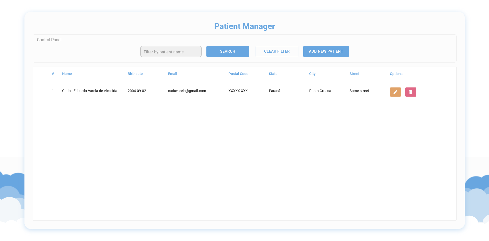
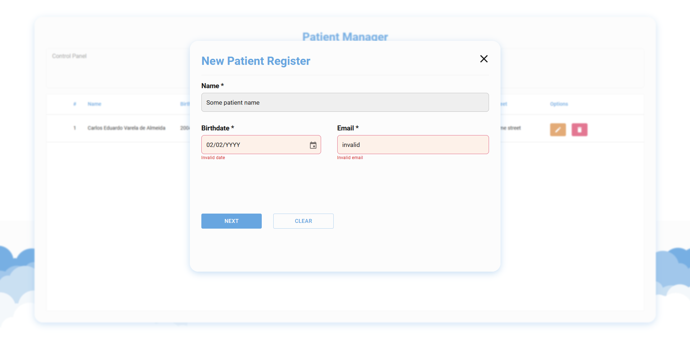
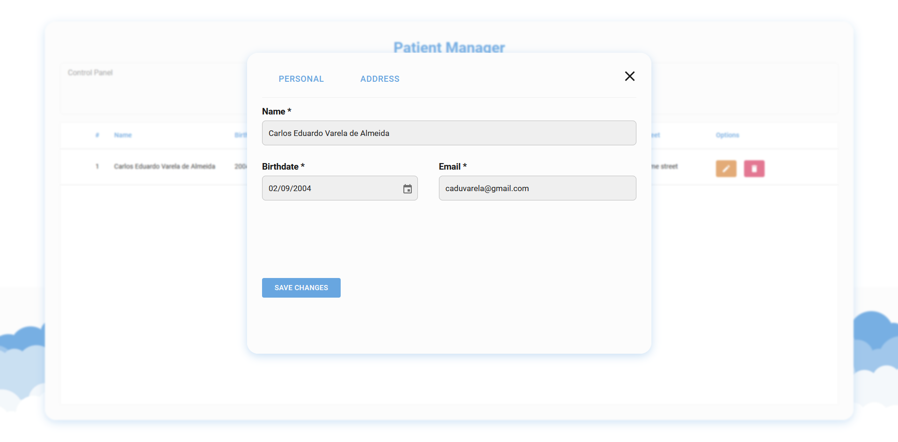
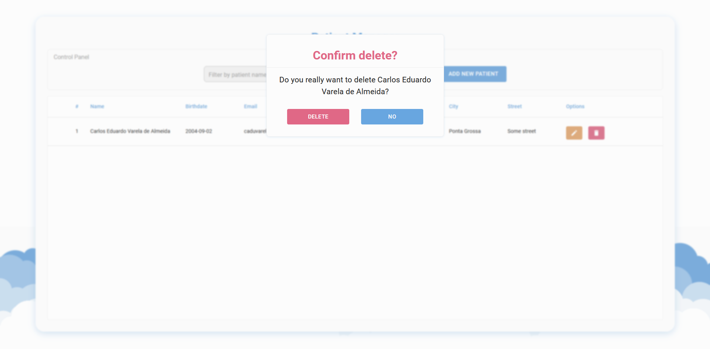

# About the project

This project was made as a solution to [Medcloud](https://medcloud.link/)'s development challenge nine, you can check all of its details and requirements [here](https://github.com/medcloudbr/development-challenge-nine).

# Project Setup

## Requirement

- [Docker](https://www.docker.com/) installed in your machine.

## Instructions

1. Clone this repository and enter the folder:

```bash
    git clone git@github.com:CaduVarela/development-challenge-nine.git
    cd development-challenge-nine
```

2. Make sure the ports below are available in your machine:

```
    3000 // Client/frontend Port
    22194 // Server/backend Port
    3307 // Mysql Database Port
```

3. Make sure to have docker engine running. Build and run the project with docker-compose:

```bash
    docker-compose up
```

PS: the third step may take long as it is installing all the project dependencies and setting up the database.

After this the application should be up and running and you can check the following localhost addresses:

```bash
    http://localhost:3000 <- client address
    http://localhost:22194/patients <- server address (/patients is the rout where you can see the current DB patients in JSON format)
```

# Project preview

## Patient Manager (Main Screen)



This is where you'll be able to control all the project features and manage patients.

## Create and Update Patient

This is the same react component, you can controll it using the variant prop.

### New Patient

variant="new"



Here you can add a new patient.

### Manage/edit Patient

variant="manager" (default)



Here you can update data of a individual patient.

## Delete Confirmation



You certainly don't want to remove a patient by mistake.

# Thank you!

Thank you for checking my solution, it was a lot of fun and I learned a lot through the development process of this project.

You can see other's solution to this challenge [here](https://github.com/medcloudbr/development-challenge-nine/forks).

See ya! ;)